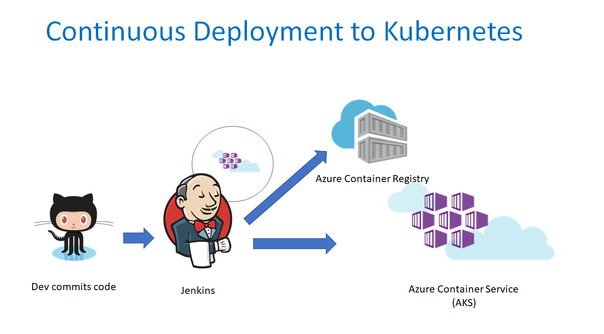

# BikeSharing360Node  
   This demo sets up Jenkins CICD pipeline in Azure. It provisions a Jenkins VM, An Azure container registry and two Azure AKS clusters. One is used as Jenkins build slaves and the other is used to deploy the nodejs application. When a commit is checked into the source repo, a Jenkins build job will be triggered. It builds a new docker image, pushs the image into the Azure container registry and deploys the image into AKS cluster.  
   
   This is the workflow:  
   

## Prerequisites
* [kubectl](https://kubernetes.io/docs/tasks/tools/install-kubectl/)  
* [Azure cli](https://docs.microsoft.com/en-us/cli/azure/install-azure-cli-apt?view=azure-cli-latest)  
* [Install docker](https://docs.docker.com/install/linux/docker-ce/ubuntu/)  

## Deployment script
1. login your Azure CLI, and set your subscription id
    ```bash
    az login
    az account set -s <your-subscription-id>
    ```

1. set group_suffix value
    ```bash
    group_suffix=$((RANDOM % 100000))  
    ```
1. set target location, jenkins user name and jenkins password
    ```bash
    targetlocation=centralus  
    jenkinsusername=azureuser  
    jenkinspassword=OssDemoV2Aks  
    ```

1. generate resource group names
    ```bash
    ossdemo_group=OssDemo${group_suffix}  
    ossdemoaks_group=OssDemoAks${group_suffix}  
    ```

1. generate service principal
    ```bash
    service_principal=$(az ad sp create-for-rbac -n "${ossdemo_group,,}")  
    export app_id=$(echo "$service_principal" | grep "appId" | cut -d '"' -f4)  
    export app_key=$(echo "$service_principal" | grep "password" | cut -d '"' -f4)  
    ```

1. create resource group and provision Azure ACR
    ```bash
    az group create -n ${ossdemo_group} -l ${targetlocation}  
    az acr create -n ${ossdemo_group,,} -g ${ossdemo_group} --admin-enabled true --sku Standard  
    export acr_name=${ossdemo_group,,}  
    export acr_username=$(az acr credential show -g ${ossdemo_group} -n ${acr_name} --query username | tr -d '"')  
    export acr_password=$(az acr credential show -g ${ossdemo_group} -n ${acr_name} --query passwords[0].value | tr -d '"')  
    export acr_server=$(az acr show -g ${ossdemo_group} -n ${acr_name} --query loginServer | tr -d '"')  
    ```

1. create resource group and Azure Container Service (AKS)
    ```bash
    az group create -n ${ossdemoaks_group} -l ${targetlocation}  
    az aks create -g ${ossdemoaks_group} -n aks --node-count 1 --generate-ssh-keys  
    az aks create -g ${ossdemo_group} -n jenkinsaks --node-count 1 --generate-ssh-keys  
    ```

1. create secrete in AKS
    ```bash
    rm ~/.kube/config  
    az aks get-credentials --resource-group ${ossdemoaks_group} --name aks --admin  
    docker login ${acr_server} -u ${acr_username} -p ${acr_password}  
    export regsec=$(cat ../.docker/config.json | base64  | tr -d '\n')  
    cat secret.yaml | sed "s/dockersecret/${regsec}/g" | kubectl create -f -  
    ```

1. deploy application
    ```bash
    cat k8s.yaml | sed -e "s/YourACRName/${acr_username}/g" | kubectl create -f -  
    ```

1. deploy secret into Jenkins slave cluster
    ```bash
    az aks get-credentials --resource-group ${ossdemoaks_group} --name aks --admin --file aksconfig  
    rm ~/.kube/config  
    az aks get-credentials --resource-group ${ossdemo_group} --name jenkinsaks --admin  
    kubectl create secret generic config --from-file=config=aksconfig  
    ```

1. provision Jenkins host
    ```bash
    sed -e "s/YourPassword/${jenkinspassword}/g" -e "s/YourDNS/${ossdemo_group,,}/g" -e "s/YourRGName/${ossdemo_group}/g" -e "s/YourSPId/${app_id}/g" -e "s/YourSPSecret/${app_key}/g" -e "s/YourACRName/${acr_username}/g" -e "s/YourACRPassword/${acr_password//'/'/'\/'}/g" parameters.json > parameters2.json  
    az group deployment create -g ${ossdemo_group} --template-file template.json --parameters @parameters2.json  
    export jenkins_ip=$(az network public-ip list -g ${ossdemo_group} --query [0].ipAddress | tr -d '"')  
    ```
